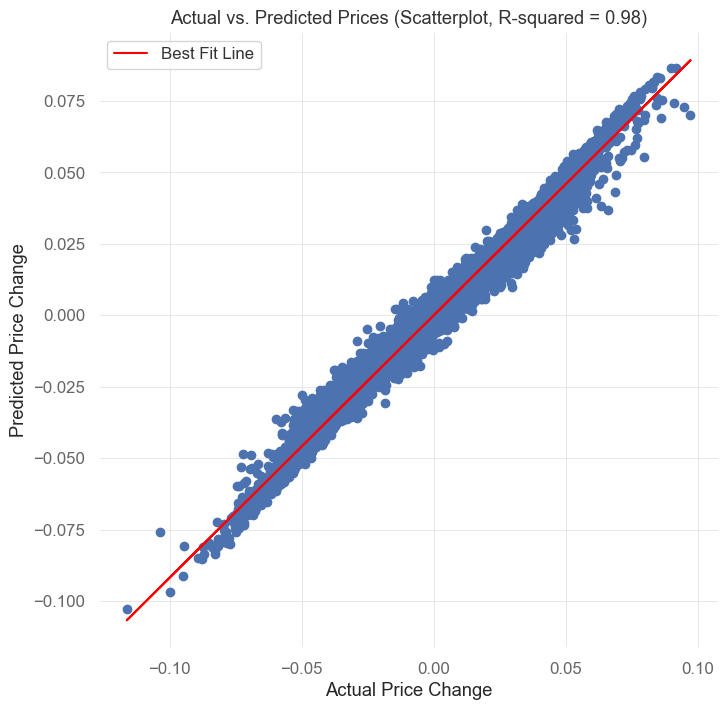

# Eric's Backtesting and Feature Generation

## Table of Contents

- [About](#about)
- [Getting Started](#getting_started)
- [Usage](#usage)
- [Contributing](../CONTRIBUTING.md)

## About 

Personal repo where I test and explore various strategies and methods for generating features on market data.

## Getting Started 

Simply clone the repo and install the dependencies in the requirements.txt
You might start with the random forest files which all start with the random forest examples. 

`

### Prerequisites
If using conda create an environment and then activate the environment. You can either conda install each of the packages or install them from the requirements.txt file. Or, you can `pip install -r requirements.txt`

[requirements.txt](requirements.txt) should have all you need.

## Usage 

This repo is a collection of files and a constant work in progress. I am always testing and bouncing around on new files. I will try to keep the repo organized with good docstrings in each of the files, but I'm only human, so go easy on me.

For a good starting point check out [The Random Forest Notebook](random-forest/random-forest-testing-momo-v1.2.ipynb)

- The file uses a random forest to build a model based on features that I generated on btc data. I tried to comment things pretty well. The model will then make predictions on the future price moves of bitcoin. Here is an example of the output. 

        - For a threshold of: 0.001
        - MSE: 1.2729619990324905e-06
        - RMSE: 0.0011
        - Accuracy: 83.8493%
        - Direction Accuracy: 96.6824% 
          - This happened 486013 times out of 502690
        - R-squared: 0.9802
    